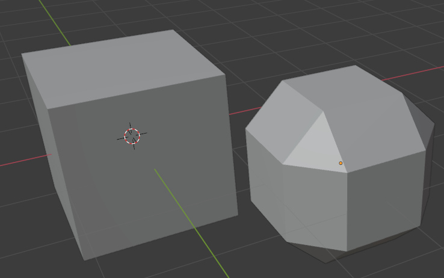
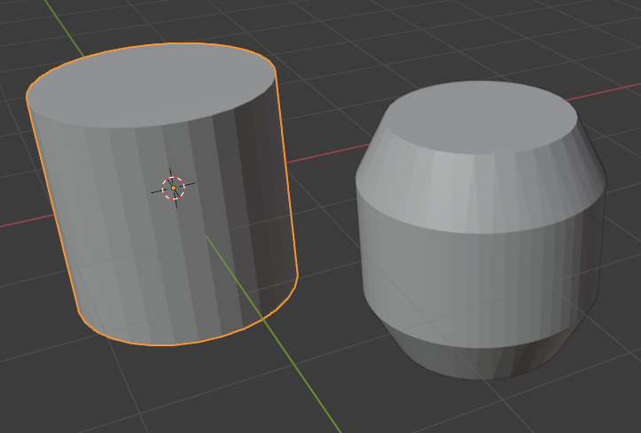

# bpydoosabin
bpyhullgen is a doo sabin subdivision script for blender.

The [Original Version](https://scorpius.github.io/) was written in 2005 for Blender 2.37.

This version modifies the previous version to work on blender 2.93

Example subdivisions:

