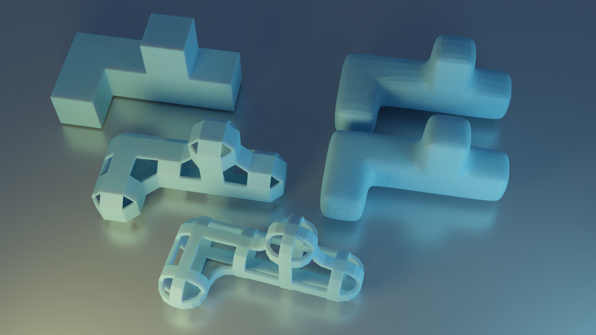
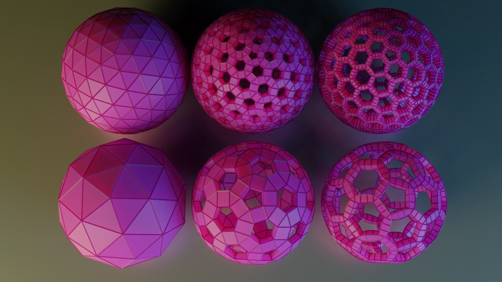
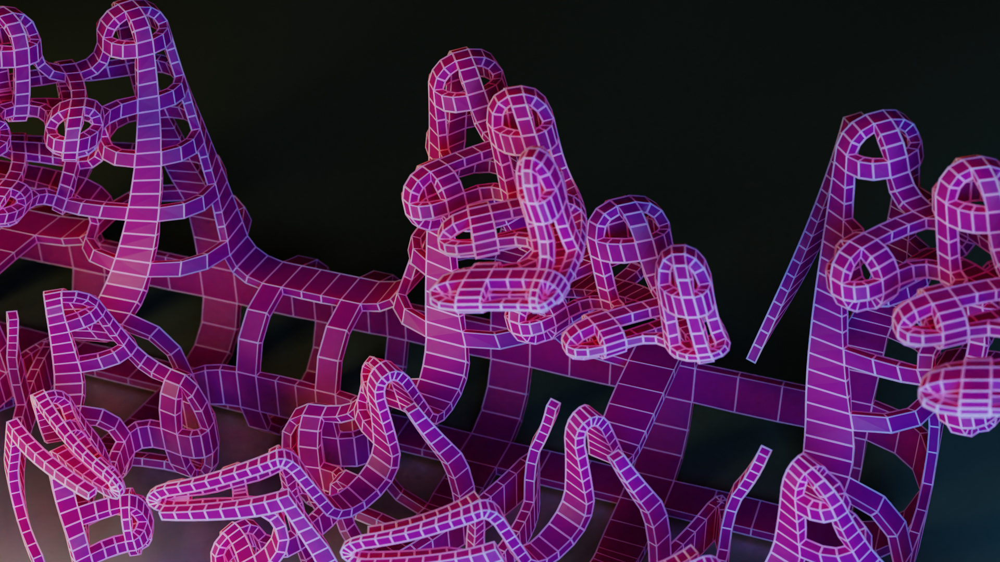
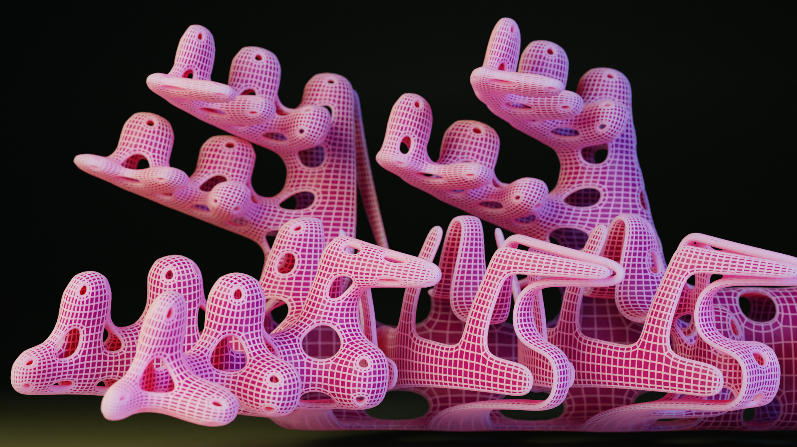
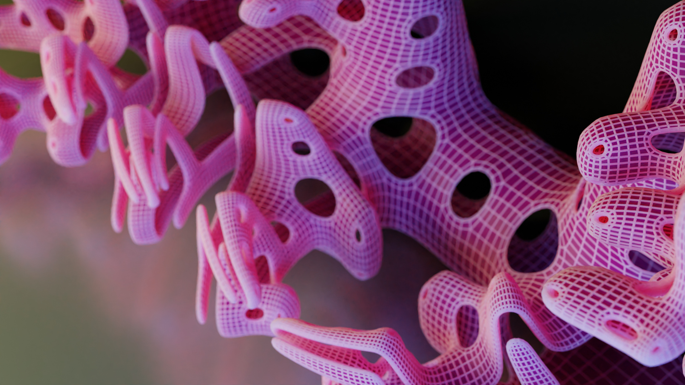
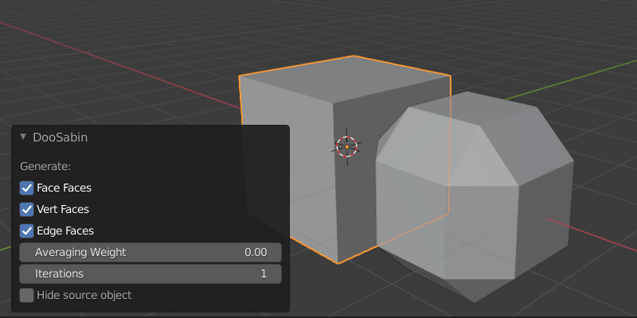
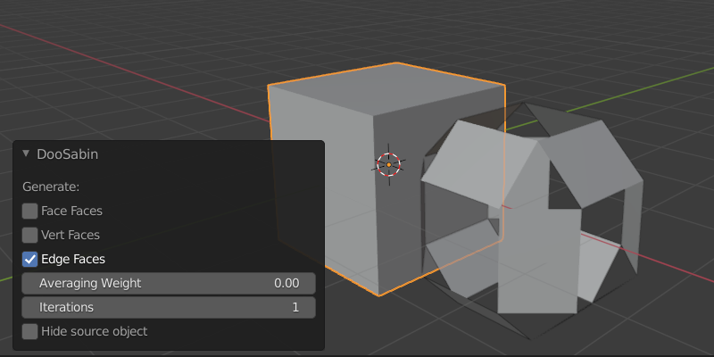
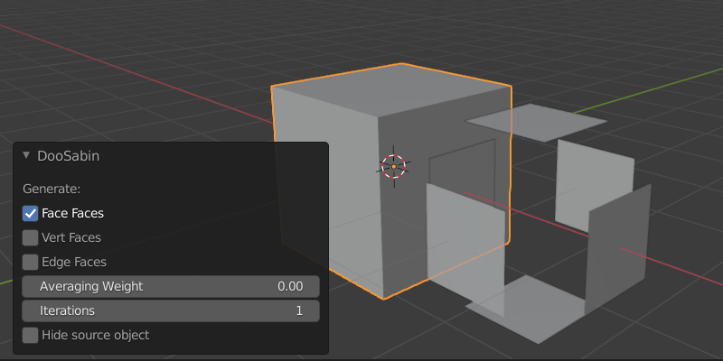
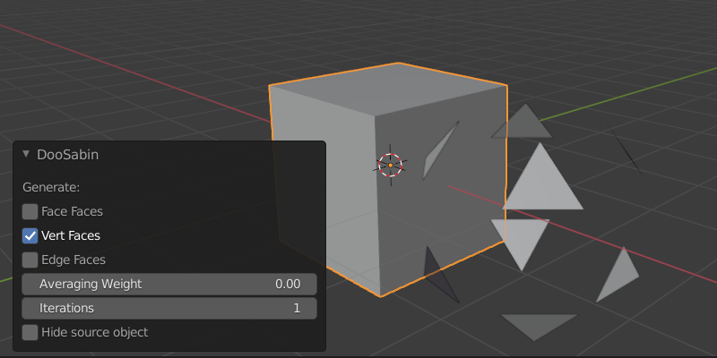
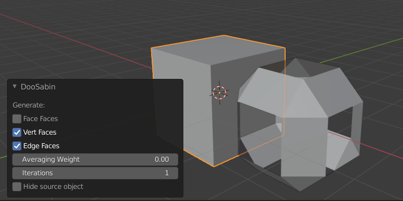

# bpydoosabin
bpydoosabin is a doo sabin subdivision script for blender.

The [Original Version](https://scorpius.github.io/blender-plugins.htm) was written in 2005 for Blender 2.37.

This version modifies the previous version to work on blender 2.93

## Examples

Top left - Original Mesh

Right side - Catmull Clark (1 and 2 levels)

Bottom - doo sabin (1 and 2 levels) with vertfaces disabled (the holes)

Testing on two different icospheres (top 3 subdivisions, bottom 2 subdivisions).

Left no doo sabin, center doo sabin once, right doo sabin twice.

## Options

Generate All Faces

Generate Edge Faces Only

Generate Face Faces Only

Generate Vert Faces Only

Generate Vert and Edge Faces Only

## Installation
Clone this repository into your `blender/scripts/addons` directory then enable via blender addon preferences. Select an object and press F3 to search for operators. Type or choose doosabin

## Todo

- ~~Add GUI for changing parameters on the fly and adjusting options~~
- ~~Ability to toggle edge_faces and vert_faces on or off~~

- ~~Update readme to describe nomenclature for generated face types~~
- ~~Update bmesh updater to reuse vertex (currently vertices are created for each face and not reused. Currently need to remove doubles after generation until this is fixed)~~
- ~~Add parameter to adjust weight of vertex to normal averaging to finetune generated geometry.~~

### Update July 19th 2021
- Refactor to class structure
- Add UI
- Separate UI into it's own py file
- Add toggle for generating vert faces
- Add toggle for generating face faces
- Add toggle for generating edge faces 
- Add iterations parameter
- Add toggle for hiding original object - if original is not hidden the new generated object is placed to the right of original for comparison. 
- Add averaging weight parameter
- Reuse bmesh verts to prevent doubles and requrement for post cleanup